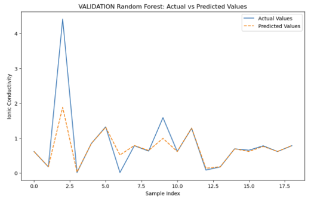
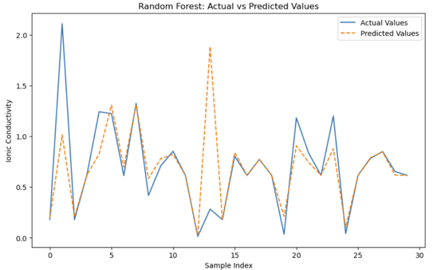
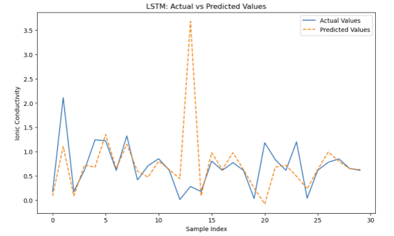
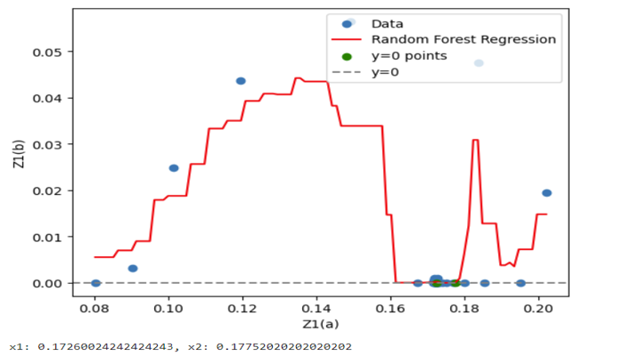

  

<h1 align="center">ML Battery Prediction Artifact</h1>

<h3 align="center">Machine Learning-Based Prediction of Solid-State Lithium Battery Performance</h3>

<b>Artifact 2 – Professional Portfolio Submission</b>

---

  
  
  
  

## 📌 About Me
My name is **Emmanuel Durowoju**, and I am currently studying **Artificial Intelligence – Data Analytics**.  
My career goal is to become a **renowned expert in applying AI to semiconductor processing and materials engineering**, using data-driven methods to improve yield, reliability, and device performance.

📧 **Contact:** durowojues@yahoo.com

---

## 📘 Project Description  
This project applies machine learning techniques to predict the performance of **solid-state electrolyte (SSE) lithium batteries doped with various materials**. Using structured electrochemical data—including **impedance (Z’ and Z’’), ionic conductivity, temperature effects, voltage profiles, and current density**—the models evaluate how dopant composition influences overall battery behavior.

The study implements and compares several ML algorithms:

- **Nonlinear Regression**  
- **Decision Tree**  
- **Random Forest**  
- **Gradient Boosting Regression**  
- **Support Vector Machine (SVM)**  
- **LSTM Neural Networks** (for sequential predictions)

These models were trained and validated on experimental EIS datasets representing multiple doped electrolyte materials (Mo-doped, Ce-doped, Li3InCl4.8F1.2, LINH316_Labmade, and others). Random Forest and Gradient Boosting achieved strong predictive performance due to their ability to model nonlinear relationships and handle noisy electrochemical measurements.

This project helps identify which dopant-material combinations produce the highest ionic conductivity and most stable electrochemical response—supporting improved battery design and performance optimization.

---

## 🛠️ Skills Demonstrated
- Machine Learning (Decision Tree, Random Forest, Gradient Boosting, SVM, LSTM)  
- Model Evaluation (R², RMSE, validation plots, predicted vs actual curves)  
- Feature Engineering (EIS impedance extraction, Z'/Z’’ preprocessing)  
- Python (pandas, NumPy, scikit-learn, matplotlib)  
- Excel Analytics  
- Scientific Data Visualization  
- Research Analysis & Interpretation  
- Technical Writing  

---

## 🧠 Reflection  
I selected this artifact because it demonstrates my ability to apply machine learning to complex scientific data and real engineering challenges. This project strengthened my understanding of data preprocessing, feature extraction from impedance spectra, and evaluating multiple ML algorithms for predictive accuracy. It also allowed me to link domain knowledge—battery chemistry, temperature effects, ionic transport—with AI modeling. This work represents an important step toward my goal of using AI to improve semiconductor processes, materials engineering, and advanced battery systems.

---

## 📎 Repository Contents
- `notebooks/` – Python notebooks demonstrating model training and evaluation  
- `figures/` – Plots of impedance vs performance, predicted vs actual curves  
- `data/` – Sample structured datasets  
- `README.md` – Project overview (this file)  

## 📊 Key Model Results and Figures  
1. Random Forest vs Gradient Boosting — Impedance Prediction at 25°C

This figure shows how Random Forest and Gradient Boosting regression models predict the imaginary impedance component (Z1(b)) from the real component (Z1(a)). The intersection with the x-axis is used to estimate ionic conductivity.

2. Random Forest vs LSTM — Training & Testing Performance

This comparison evaluates how well Random Forest and LSTM models learn ionic conductivity trends using non-impedance features. The closer the predicted curve is to the actual values, the better the model generalizes.

3. Random Forest vs LSTM — Validation Results

This validation plot demonstrates the performance of both models on unseen data. The Random Forest typically produces more stable predictions with lower RMSE, while the LSTM sometimes fluctuates more due to the small dataset size.

4. Random Forest vs Gradient Boosting — Impedance Prediction at 35°C

At elevated temperature (35°C), the impedance curve shape shifts, and the models respond differently. This plot illustrates model robustness across temperature conditions.

5. Additional Visualizations (Optional)

If you uploaded more plots (e.g., model residuals, ionic conductivity comparisons), you can follow the same pattern:

---

## 📄 License
This project is part of an academic research program. Content should not be reused without permission.

